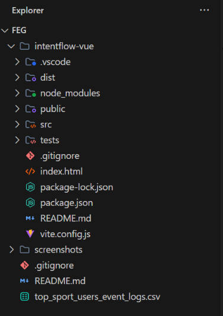

# IntentFlow – AI-Powered Session Quality & Conversion Engine

> **FEG Innovation Hackathon 2026 — Challenge 1: Session Quality & Conversion**

**IntentFlow** is an AI-powered session-quality and conversion optimization engine that understands **what a user actually wants**, uses conversational and behavioral context, adapts to **new and returning users**, and guides users toward meaningful outcomes without unnecessarily extending their session.

Instead of optimizing for clicks, page views, or session duration, IntentFlow focuses on:

> **Meaningful progress → Goal completion → Better session quality**

The key idea is simple:

**Understand intent → Understand context → Guide intelligently → Complete the goal → Know when to stop.**

---

## 🚀 Problem Statement

Traditional websites often evaluate a successful session using metrics such as:

* Number of clicks
* Pages visited
* Session duration
* Recommendations viewed
* Conversion events

However, these metrics do not necessarily represent a **good user experience**.

A user spending 15 minutes on a website may not be highly engaged — they may simply be **confused**.

Similarly, continuously showing recommendations after a user has completed their goal can create unnecessary interactions.

### Common Problems

* Users struggle to find the correct service or information.
* Websites react to clicks instead of understanding intent.
* New users receive too many options without proper guidance.
* Returning users are forced to repeat previous steps.
* Previous conversations and actions are not effectively reused.
* Recommendation systems can become **greedy**, continuously pushing additional actions.
* High session duration can incorrectly be interpreted as success.

IntentFlow addresses these problems by making **user intent and meaningful outcomes the center of session optimization.**

---

# 💡 Our Solution

IntentFlow introduces an AI-powered **IntentFlow Engine** between the user and the website.

The engine analyzes:

* Current user message
* User interactions
* Conversation context
* Previous session information
* Previous completed actions
* Previous abandoned journeys
* Current navigation behavior
* Intent confidence
* Session progress

It then determines:

1. **Who is the user?**
2. **What does the user actually want?**
3. **How confident are we about that intent?**
4. **What should we guide the user toward?**
5. **Has the user already achieved their goal?**
6. **Should we continue helping or stop?**

---

# 🧠 IntentFlow Architecture

```text
                    ┌──────────────────────┐
                    │        User          │
                    │ Message / Interaction│
                    └──────────┬───────────┘
                               │
                               ▼
                    ┌──────────────────────┐
                    │ Context Collection   │
                    │ Current Session      │
                    └──────────┬───────────┘
                               │
                               ▼
                    ┌──────────────────────┐
                    │ User Classification  │
                    │ New / Regular User   │
                    └──────────┬───────────┘
                               │
                 ┌─────────────┴─────────────┐
                 │                           │
                 ▼                           ▼
        ┌─────────────────┐        ┌─────────────────┐
        │   New User      │        │  Regular User   │
        │ Learn Intent    │        │ Previous Context│
        └────────┬────────┘        └────────┬────────┘
                 │                          │
                 └─────────────┬────────────┘
                               ▼
                    ┌──────────────────────┐
                    │  IntentFlow AI      │
                    │       Engine        │
                    └──────────┬───────────┘
                               │
                               ▼
                    ┌──────────────────────┐
                    │ Intent Detection     │
                    │ + Context Analysis   │
                    └──────────┬───────────┘
                               │
                               ▼
                    ┌──────────────────────┐
                    │ Intent Confidence    │
                    └──────────┬───────────┘
                               │
              ┌────────────────┼────────────────┐
              │                │                │
              ▼                ▼                ▼
          High Intent      Medium Intent      Low Intent
              │                │                │
              ▼                ▼                ▼
        Direct Guidance   Clarification      Discovery
              │                │                │
              └────────────────┼────────────────┘
                               ▼
                    ┌──────────────────────┐
                    │ Meaningful Action    │
                    └──────────┬───────────┘
                               │
                               ▼
                    ┌──────────────────────┐
                    │ Session Quality      │
                    │ Evaluation           │
                    └──────────┬───────────┘
                               │
                               ▼
                    ┌──────────────────────┐
                    │ Goal Completed?      │
                    └──────────┬───────────┘
                               │
                    ┌──────────┴──────────┐
                    │                     │
                   YES                   NO
                    │                     │
                    ▼                     ▼
              STOP / Respect        Continue Guidance
                 the Goal
```


## 
---

# 🔥 Key Innovation

## Intent-Aware Session Optimization

Traditional systems ask:

> **"How can we get the user to interact more?"**

IntentFlow asks:

> **"How can we help the user achieve what they actually came here to do?"**

This creates a major shift from:

**Engagement Optimization**

to:

**Meaningful Outcome Optimization**

---

# ✨ Key Features

## 1. 🤖 AI Intent Detection

IntentFlow analyzes natural-language input and user behavior to identify the user's underlying goal.

Example:

> "I need to apply for a certificate."

The system detects:

```text
Primary Intent:
Certificate Application

Intent Stage:
Pre-Application

Confidence:
Medium / High

Next Best Action:
Show application process
```

---

## 2. 👤 New User Intelligence

A new user has little or no historical context.

Instead of overwhelming them with recommendations, IntentFlow:

* Starts with broad intent detection.
* Provides simple options.
* Uses minimal clarification.
* Learns from the user's interaction.
* Increases confidence as the user provides more information.
* Gradually moves from discovery to direct guidance.

### New User Example

A new user enters the website and says:

> **"I need a government certificate."**

IntentFlow initially detects a broad intent.

```text
User Type: New User
Intent: Certificate Related
Confidence: Medium
```

Instead of showing dozens of services, the system provides focused choices:

```text
What would you like to do?

1. Apply for a certificate
2. Check an existing application
3. Download a certificate
4. View required documents
```

The user selects:

> **"Apply for a certificate."**

The engine updates the intent:

```text
Intent: Certificate Application
Confidence: High
```

Now IntentFlow directly guides the user through:

```text
Application Process
        ↓
Required Documents
        ↓
Application Form
        ↓
Submission
        ↓
Confirmation
```

After successful completion:

> **Goal Completed ✓**

IntentFlow **stops unnecessary recommendations**.

It does not continue pushing unrelated services simply to increase clicks.

---

# 3. 🔄 Regular User Intelligence

Returning users already have useful context.

Instead of treating them like completely new users, IntentFlow can use meaningful previous context such as:

* Previously searched services
* Previously visited pages
* Completed applications
* Abandoned applications
* Previous questions
* Previous conversation context
* Previously identified intent

This allows the system to reduce repeated questions and continue unfinished journeys.

---

# 🧑‍💻 Regular User Example

Suppose a user previously visited the website.

### Previous Session

The user:

```text
Searched → Certificate
        ↓
Viewed → Required Documents
        ↓
Started → Application
        ↓
Abandoned → Application Form
```

Later, the same user returns.

Instead of asking:

> "What are you looking for?"

IntentFlow recognizes the previous context.

It can infer:

```text
User Type:
Regular User

Previous Intent:
Certificate Application

Previous Stage:
Application Form

Current Intent:
Likely continuation

Confidence:
High
```

The system can then provide:

> **"You previously started your certificate application. Would you like to continue where you left off?"**

The user continues directly.

This removes unnecessary navigation and repeated questions.

---

# 🧠 4. Previous Chat & Context Understanding

IntentFlow does not simply store raw conversations.

It extracts **meaningful context** from previous interactions.

For example:

### Previous Conversation

**User:**

> "I want to apply for a certificate."

**Assistant:**

> "You need these documents..."

Later:

**User:**

> "What if I don't have one of them?"

IntentFlow understands that:

> "one of them"

refers to the documents required for the **certificate application**.

Instead of treating the second message as an unrelated question, the engine connects it with the parent intent.

```text
Parent Intent:
Certificate Application

Sub Intent:
Document Eligibility

Previous Context:
Required Documents

Current Question:
Missing Document

Next Action:
Explain alternative eligibility/document process
```

This creates a more natural and intelligent user journey.

---

# 🎯 5. Confidence-Based Guidance

IntentFlow does not always assume it knows exactly what the user wants.

It evaluates **intent confidence**.

### High Confidence

When the user's intent is clear:

```text
High Confidence
       ↓
Direct Guidance
       ↓
Fast Path to Goal
```

Example:

> "I want to renew my driving license."

The system can directly provide the renewal process.

### Medium Confidence

When multiple interpretations are possible:

```text
Medium Confidence
       ↓
Minimal Clarification
       ↓
Focused Options
```

### Low Confidence

When the system is unsure:

```text
Low Confidence
       ↓
Broad Discovery
       ↓
Learn User Intent
```

This prevents the AI from confidently guiding users toward the wrong service.

---

# 🛑 6. Anti-Greediness / Ethical Conversion

One of the core innovations of IntentFlow is **knowing when not to recommend anything else.**

Traditional optimization can become:

```text
User completes goal
       ↓
Show recommendation
       ↓
User clicks
       ↓
Show another recommendation
       ↓
More clicks

       ↓
Longer session
```

IntentFlow instead follows:

```text
User completes goal
       ↓
Check for remaining strong intent
       ↓
       ├── No → STOP
       │
       └── Yes → Optional next step
```

### Core Rule

> **A successful conversion is not permission to keep the user engaged.**

If the user's goal is complete and there is no strong remaining intent, the system stops.

This improves:

* User trust
* Session quality
* Task completion
* User satisfaction
* Efficiency

---

# 📊 7. Session Quality Evaluation

IntentFlow evaluates sessions using **meaningful outcomes rather than raw activity.**

Important signals include:

| Metric                       | Meaning                                         |
| ---------------------------- | ----------------------------------------------- |
| Intent Accuracy              | How accurately the user's goal was identified   |
| Intent Confidence            | Confidence in detected intent                   |
| Goal Completion Rate         | Percentage of users achieving their goal        |
| Time to Meaningful Action    | Time required to reach useful progress          |
| Guidance Success             | Whether recommendations helped                  |
| Unnecessary Interaction Rate | Extra clicks/actions that provided little value |
| Abandonment Rate             | Users leaving before achieving their goal       |
| Confusion Signals            | Evidence that the user is struggling            |
| Recommendation Acceptance    | Whether relevant guidance was accepted          |

### Conceptual Session Score

```text
Session Quality Score =

Goal Progress
+ Intent Confidence
+ Successful Guidance
+ Meaningful Conversion
- Unnecessary Interactions
- Confusion Signals
- Abandonment
```

The goal is not to maximize the number of interactions.

The goal is to maximize **useful progress per interaction.**

---

# 🔁 8. Adaptive User States

IntentFlow models the user's journey through different states:

```text
Exploring
    ↓
Searching
    ↓
Comparing
    ↓
Confused
    ↓
Ready
    ↓
Converted
```

The engine changes its behavior according to the current state.

For example:

### Exploring

Provide broad but limited discovery.

### Searching

Narrow down relevant services.

### Comparing

Help distinguish between options.

### Confused

Simplify and clarify.

### Ready

Provide direct action.

### Converted

Recognize completion and stop unnecessary recommendations.

---

# ⚡ End-to-End Example

Consider a user looking for a certificate.

```text
User:
"I need a certificate."
        ↓
IntentFlow detects broad intent
        ↓
Confidence = Medium
        ↓
Minimal clarification
        ↓
User:
"I want to apply for a new one."
        ↓
Intent:
Certificate Application
        ↓
Confidence = High
        ↓
Show application process
        ↓
User:
"What documents do I need?"
        ↓
Sub-intent:
Document Requirements
        ↓
Show required documents
        ↓
User starts application
        ↓
Application submitted
        ↓
Conversion achieved
        ↓
IntentFlow checks remaining intent
        ↓
No strong remaining intent
        ↓
STOP
```

This is a **high-quality session** because the user achieved their goal with minimal unnecessary interaction.

---

# 🏗️ How IntentFlow Works

## Step 1 — Collect Context

The system collects relevant signals from the current session.

```text
User Message
Clicks
Navigation
Previous Actions
Conversation Context
```

---

## Step 2 — Identify User Type

```text
                User
                  │
        ┌─────────┴─────────┐
        │                   │
     New User          Regular User
        │                   │
 Learn Intent       Use Previous Context
```

---

## Step 3 — Understand Intent

The AI analyzes natural language and interaction patterns.

```text
Input
 ↓
Context Analysis
 ↓
Intent Extraction
 ↓
Primary Intent
 ↓
Sub Intent
 ↓
Confidence
```

---

## Step 4 — Select Guidance Strategy

```text
High Confidence
      ↓
Direct Action

Medium Confidence
      ↓
Minimal Clarification

Low Confidence
      ↓
Discovery
```

---

## Step 5 — Track Progress

IntentFlow continuously evaluates whether the user is moving toward their goal.

```text
No Progress
    ↓
Adjust Guidance

Progress
    ↓
Continue

Goal Completed
    ↓
Evaluate Remaining Intent
```

---

## Step 6 — Recognize Conversion

Conversion is defined by **meaningful goal completion**.

Examples:

* Application successfully submitted
* Correct service found
* Required information obtained
* Request completed
* Previously abandoned task resumed and completed

---

## Step 7 — Know When to Stop

Once the user's goal is complete:

```text
Goal Complete
     ↓
Remaining Strong Intent?
     ↓
 ┌───┴────┐
 │        │
No       Yes
 │        │
STOP   Optional Next Step
```

---

# 🧩 Example Intent Context

IntentFlow can transform conversational and behavioral information into structured context such as:

```json
{
  "user_type": "regular",
  "primary_intent": "certificate_application",
  "sub_intent": "document_requirements",
  "intent_confidence": 0.91,
  "session_stage": "pre_application",
  "previous_actions": [
    "searched_certificate",
    "viewed_requirements",
    "started_application"
  ],
  "recommended_action": "show_document_requirements"
}
```

This structured representation allows the system to reason about the user's journey instead of treating every interaction independently.

---

# 🖥️ Prototype Experience

The IntentFlow prototype demonstrates the complete journey:

```text
Home
  ↓
Discover
  ↓
User Interaction
  ↓
Intent Detection
  ↓
Personalized Guidance
  ↓
Meaningful Action
  ↓
Session Quality
```

The interface can provide:

* User intent
* Intent confidence
* Current session stage
* Personalized recommendations
* Goal progress
* User classification
* Session quality indicators
* Conversion status

---

# 🛠️ Technology Stack

## Frontend

* React
* JavaScript
* HTML5
* CSS3
* Vite

## Backend

* Python
* FastAPI
* Uvicorn

## AI Layer

* OpenAI models
* AI-powered intent detection
* Context understanding
* Conversational reasoning
* Personalized guidance

## Development

* VS Code
* Git
* GitHub

## Deployment

* Vercel — Frontend
* Render — Backend

---

# 📁 Project Structure

```text
IntentFlow/
│
├── frontend/
│   ├── src/
│   ├── public/
│   ├── package.json
│   └── vite.config.js
│
├── backend/
│   ├── app/
│   ├── requirements.txt
│   └── main.py
│
├── screenshots/
│   ├── dashboard.png
│   ├── new-user-flow.png
│   └── regular-user-flow.png
│
├── .gitignore
└── README.md
```
## 
> Adjust the folder names above to match the final repository structure.

---

# ⚙️ Installation

## 1. Clone the Repository

```bash
git clone https://github.com/YOUR_USERNAME/IntentFlow.git
cd IntentFlow
```

---


# 🌐 Frontend Setup

Open another terminal:

```bash
cd intentflow-vue
npm install
npm run dev
```

Vite will provide the local development URL.

---


Add environment files to `.gitignore`:

```text
.env
.env.local
.env.production
venv/
__pycache__/
node_modules/
```

---


# 🔗 Frontend–Backend Communication

The architecture is:

```text
User
 │
 ▼
React Frontend
 │
 │ HTTP Request
 ▼
FastAPI Backend
 │
 ▼
IntentFlow AI Engine
 │
 ├── Intent Detection
 ├── Context Understanding
 ├── User Classification
 ├── Guidance
 └── Session Quality
 │
 ▼
Response
 │
 ▼
React UI
```

For production deployment, make sure:

* Frontend uses the deployed backend URL.
* Backend CORS allows the deployed frontend domain.
* API keys remain on the backend.
* Localhost URLs are not used in production.

---

# 🧪 Example Scenarios

## Scenario 1 — New User

```text
"I need a government certificate."

          ↓

New User Detected

          ↓

Broad Intent:
Certificate

          ↓

Minimal Clarification

          ↓

"I want to apply for a new certificate."

          ↓

High Confidence Intent

          ↓

Certificate Application

          ↓

Required Documents

          ↓

Application

          ↓

Submission

          ↓

Goal Completed ✓

          ↓

STOP
```

---

## Scenario 2 — Regular User

```text
Previous Session

Certificate Search
        ↓
Requirements Viewed
        ↓
Application Started
        ↓
Application Abandoned

          ↓

User Returns

          ↓

Regular User Detected

          ↓

Previous Context Retrieved

          ↓

Likely Intent:
Continue Certificate Application

          ↓

Offer:
"Continue where you left off?"

          ↓

User Continues

          ↓

Application Completed ✓

          ↓

STOP
```
###  
---
# 🧠 Challenges & Technical Obstacles

## 1. Understanding Real Intent

A click does not always represent a user's actual goal.

### Solution

IntentFlow combines:

* Natural-language understanding
* Current context
* User actions
* Conversation history
* Session stage

to identify the underlying intent.

---

## 2. Maintaining Context

Users may refer to previous messages indirectly.

For example:

> "What if I don't have that document?"

### Solution

The engine maintains parent and sub-intent relationships so that follow-up questions remain connected to the original goal.

---

## 3. Preventing Greedy Recommendations

Traditional systems may continue recommending content after the user has completed their task.

### Solution

IntentFlow introduces a **goal-completion and stop decision**.

The system asks:

> "Is there another strong user intent?"

If not:

**Stop.**

---

## 4. New vs Regular Users

A new user needs discovery while a returning user needs continuity.

### Solution

IntentFlow uses separate strategies:

```text
New User
→ Learn Intent
→ Reduce Overload
→ Guide

Regular User
→ Use History
→ Continue Journey
→ Reduce Repetition
```

---

## 5. Deployment & Integration

Connecting a React frontend to a FastAPI backend introduced practical issues such as:

* API URL configuration
* CORS
* Environment variables
* Localhost vs production URLs
* Frontend/backend deployment coordination

These are handled through environment-based configuration and separate frontend/backend deployment.

---

# 🌱 Ethical Design Principles

IntentFlow is designed around a **user-first optimization philosophy**.

### 1. Goal Before Engagement

The user's goal is more important than increasing session duration.

### 2. Quality Before Quantity

A short successful session can be better than a long session filled with confusion.

### 3. Minimal Interaction

Ask only when clarification is actually needed.

### 4. Confidence-Aware AI

The system should not behave as if it understands the user when confidence is low.

### 5. No Forced Recommendations

Recommendations should be relevant and optional.

### 6. Know When to Stop

Once the user's goal is complete, unnecessary engagement should end.

---

# 🏆 Why IntentFlow Fits Challenge 1

| Challenge Requirement | IntentFlow Approach                                  |
| --------------------- | ---------------------------------------------------- |
| Session Quality       | Measures meaningful progress instead of raw activity |
| Conversion            | Defines conversion as actual goal completion         |
| AI                    | Uses AI for intent and context understanding         |
| Personalization       | Differentiates new and regular users                 |
| User Guidance         | Provides adaptive, confidence-based guidance         |
| Context               | Uses previous conversations and interactions         |
| Optimization          | Optimizes for useful outcomes                        |
| Responsible AI        | Prevents unnecessary recommendations                 |
| Innovation            | Introduces an AI system that knows when to stop      |

---

# 🔮 Future Enhancements

Future versions of IntentFlow can include:

* More advanced intent classification
* Real-time behavioral signal analysis
* Long-term user preference modeling
* Multi-session journey prediction
* Explainable AI recommendations
* Automatic confusion detection
* A/B testing for guidance strategies
* More advanced session-quality scoring
* Domain-specific intent models
* Voice-based intent detection
* Multilingual intent understanding
* Real-time analytics for administrators

---

# 🎯 Vision

IntentFlow aims to move websites from:

```text
"What did the user click?"
```

to:

```text
"What is the user trying to achieve?"
```

and ultimately:

```text
"Did we help them achieve it efficiently?"
```

The long-term vision is to build digital experiences that are **intent-aware, context-aware, adaptive, and responsible.**

---

# 💬 One-Line Pitch

> **IntentFlow — An AI session-quality engine that understands user intent, uses context to guide users toward meaningful outcomes, and knows when to stop.**

---

# 👩‍💻 Team

**Vasari Rishika && Bhavitha choppari**

CSE — Marri Laxman Reddy Institute of Technology

Built for **FEG Innovation Hackathon 2026 — Challenge 1: Session Quality & Conversion**

---

# 📄 License

This project is developed as a hackathon prototype for demonstration and innovation purposes.
