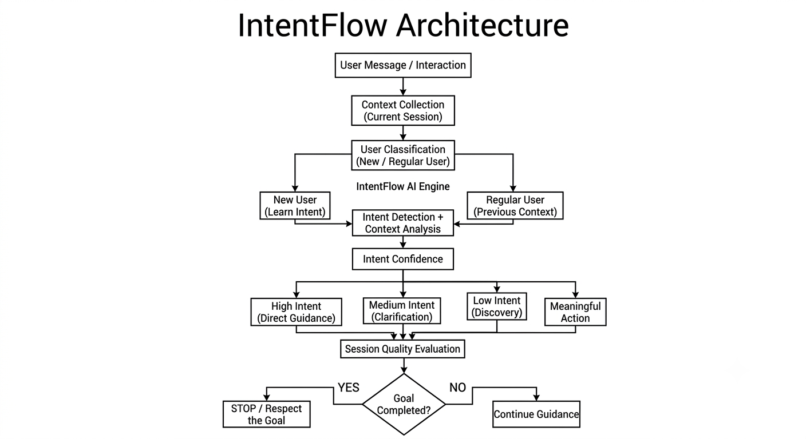
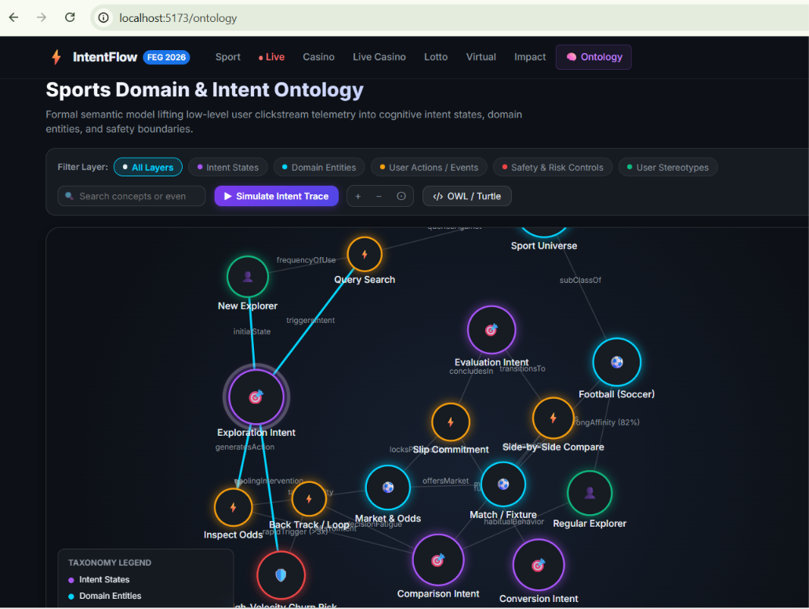
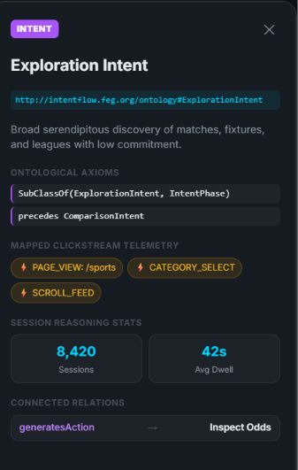
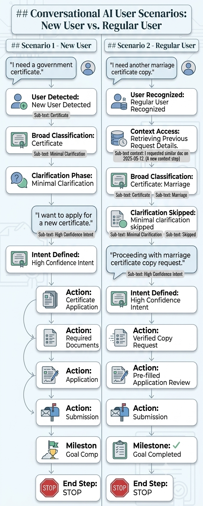

# IntentFlow – AI-Powered Session Quality & Conversion Engine

> **FEG Innovation Hackathon 2026 — Challenge 1: Session Quality & Conversion**

**IntentFlow** is an AI-powered session-quality and conversion optimization engine that understands **what a user actually wants**, uses conversational and behavioral context, adapts to **new and returning users**, and guides users toward meaningful outcomes without unnecessarily extending their session.

Instead of optimizing for clicks, page views, or session duration, IntentFlow focuses on:

> **Meaningful progress → Goal completion → Better session quality**

The key idea is simple:

**Understand intent → Understand context → Guide intelligently → Complete the goal → Know when to stop.**

> 🧠 **Semantic Grounding**: Formally grounded in the [Sports Domain & Intent Ontology (SDIO)](#-9-sports-domain--intent-ontology-sdio) (W3C OWL 2 DL / RDF Schema) with interactive D3.js Knowledge Graph visualization at `/ontology`.

---

## 🚀 Problem Statement

Traditional websites often evaluate a successful session using metrics such as:

* Number of clicks
* Pages visited
* Session duration
* Recommendations viewed
* Conversion events

However, these metrics do not necessarily represent a **good user experience**.

A user spending 15 minutes on a website may not be highly engaged — they may simply be **confused**.

Similarly, continuously showing recommendations after a user has completed their goal can create unnecessary interactions.

### Common Problems

* Users struggle to find the correct service or information.
* Websites react to clicks instead of understanding intent.
* New users receive too many options without proper guidance.
* Returning users are forced to repeat previous steps.
* Previous conversations and actions are not effectively reused.
* Recommendation systems can become **greedy**, continuously pushing additional actions.
* High session duration can incorrectly be interpreted as success.

IntentFlow addresses these problems by making **user intent and meaningful outcomes the center of session optimization.**

---

# 💡 Our Solution

IntentFlow introduces an AI-powered **IntentFlow Engine** between the user and the website.

The engine analyzes:

* Current user message
* User interactions
* Conversation context
* Previous session information
* Previous completed actions
* Previous abandoned journeys
* Current navigation behavior
* Intent confidence
* Session progress

It then determines:

1. **Who is the user?**
2. **What does the user actually want?**
3. **How confident are we about that intent?**
4. **What should we guide the user toward?**
5. **Has the user already achieved their goal?**
6. **Should we continue helping or stop?**

---

# 🧠 IntentFlow Architecture

```text
                    ┌──────────────────────┐
                    │        User          │
                    │ Message / Interaction│
                    └──────────┬───────────┘
                               │
                               ▼
                    ┌──────────────────────┐
                    │ Context Collection   │
                    │ Current Session      │
                    └──────────┬───────────┘
                               │
                               ▼
                    ┌──────────────────────┐
                    │ User Classification  │
                    │ New / Regular User   │
                    └──────────┬───────────┘
                               │
                 ┌─────────────┴─────────────┐
                 │                           │
                 ▼                           ▼
        ┌─────────────────┐        ┌─────────────────┐
        │   New User      │        │  Regular User   │
        │ Learn Intent    │        │ Previous Context│
        └────────┬────────┘        └────────┬────────┘
                 │                          │
                 └─────────────┬────────────┘
                               ▼
                    ┌──────────────────────┐
                    │  IntentFlow AI      │
                    │       Engine        │
                    └──────────┬───────────┘
                               │
                               ▼
                    ┌──────────────────────┐
                    │ Intent Detection     │
                    │ + Context Analysis   │
                    └──────────┬───────────┘
                               │
                               ▼
                    ┌──────────────────────┐
                    │ Intent Confidence    │
                    └──────────┬───────────┘
                               │
              ┌────────────────┼────────────────┐
              │                │                │
              ▼                ▼                ▼
          High Intent      Medium Intent      Low Intent
              │                │                │
              ▼                ▼                ▼
        Direct Guidance   Clarification      Discovery
              │                │                │
              └────────────────┼────────────────┘
                               ▼
                    ┌──────────────────────┐
                    │ Meaningful Action    │
                    └──────────┬───────────┘
                               │
                               ▼
                    ┌──────────────────────┐
                    │ Session Quality      │
                    │ Evaluation           │
                    └──────────┬───────────┘
                               │
                               ▼
                    ┌──────────────────────┐
                    │ Goal Completed?      │
                    └──────────┬───────────┘
                               │
                    ┌──────────┴──────────┐
                    │                     │
                   YES                   NO
                    │                     │
                    ▼                     ▼
              STOP / Respect        Continue Guidance
                 the Goal
```


## 
---

# 🔥 Key Innovation

## Intent-Aware Session Optimization

Traditional systems ask:

> **"How can we get the user to interact more?"**

IntentFlow asks:

> **"How can we help the user achieve what they actually came here to do?"**

This creates a major shift from:

**Engagement Optimization**

to:

**Meaningful Outcome Optimization**

---

# ✨ Key Features

## 1. 🤖 AI Intent Detection

IntentFlow analyzes natural-language queries, search inputs, and clickstream behavior to identify the user's underlying athletic domain interest and intent stage.

Example:

> "Show me the match odds for Arsenal vs Chelsea."

The system detects:

```text
Primary Intent:
Sports Match Evaluation (Football)

Target Entity:
Arsenal vs Chelsea (Premier League, Fixture evt-001)

Intent Stage:
Comparison / Evaluation Intent

Confidence:
94% (High Intent)

Next Best Action:
Display side-by-side odds card & comparative form guide
```

---

## 2. 👤 New User Intelligence

A new visitor arrives with zero historical clickstream telemetry.

Instead of overwhelming them with an endless feed of hundreds of sports categories, IntentFlow:

* Starts with broad exploratory intent detection.
* Provides high-signal, clean category options (Football, Basketball, Tennis).
* Uses minimal clarification to resolve ambiguity.
* Learns in real-time from early clicks (category select, odds hover).
* Increases intent confidence as signals accumulate.
* Smoothly transitions from broad exploration to focused evaluation and goal completion.

### New User Example

A new user enters the platform and types:

> **"Who is playing in the big football matches tonight?"**

IntentFlow detects broad interest in competitive football:

```text
User Type: New User (Cold Start)
Intent: Exploration (SportDomain: Football)
Confidence: Medium (72%)
```

Instead of dumping raw lists of hundreds of matches, IntentFlow provides focused, high-relevance options:

```text
Active Marquee Fixtures:

1. Arsenal vs Chelsea (Premier League) — 2.10 | 3.40 | 3.10
2. Real Madrid vs Manchester City (Champions League) — 2.45 | 3.50 | 2.70
3. View All Football Leagues
```

The user selects:

> **"Arsenal vs Chelsea"**

The engine instantly updates the user's cognitive intent state:

```text
Intent: Comparison & Evaluation
Target Fixture: Arsenal vs Chelsea
Confidence: High (93%)
```

Now IntentFlow guides the user directly through the evaluation funnel:

```text
Fixture Details (/event/evt-001)
        ↓
Head-to-Head Form Comparison (/compare)
        ↓
Inspect Market Multiplier (Decimal 2.10)
        ↓
Add Selection to Slip Container
        ↓
Confirm Selection
```

After successful completion:

> **Goal Completed ✓**

IntentFlow **actively stops unnecessary recommendations**. It does not push unrelated basketball matches or casino popups simply to force additional clicks.

---

# 3. 🔄 Regular User Intelligence

Returning sports fans have established preferences and previous session history in the FEG dataset (`top_sport_users_event_logs.csv` shows 82.4% return user affinity towards football).

Instead of treating them like strangers, IntentFlow leverages:

* Previously searched teams and leagues
* Historical category propensities (e.g., Football vs Tennis)
* Fixtures evaluated in previous sessions
* Abandoned slip selections from previous visits
* Previous conversation queries and intent stages

This eliminates redundant onboarding steps and resumes unfinished evaluations.

---

# 🧑‍💻 Regular User Example

Suppose a regular user previously visited the sports platform.

### Previous Session

The user:

```text
Searched → Premier League
        ↓
Viewed → Arsenal vs Chelsea Fixture
        ↓
Compared → Head-to-Head Form Guide
        ↓
Added to Slip → Arsenal Win (2.10)
        ↓
Abandoned → Navigated away before confirmation
```

Later, the user returns.

Instead of greeting them with a blank search bar or asking:

> "What sport do you want to explore?"

IntentFlow detects their identity and previous session context:

```text
User Type:
Regular User (82.4% Football Affinity)

Previous Intent:
Evaluation & Wager Consideration

Previous Stage:
Slip Container (Unconfirmed Selection)

Current Intent:
Likely Journey Continuation

Confidence:
94% (High)
```

The system proactively offers:

> **"Welcome back! You previously analyzed Arsenal vs Chelsea (Arsenal Win @ 2.10). Would you like to resume your selection?"**

The user resumes with a single click, completing their goal in **38 seconds** rather than 4 minutes of repetitive navigation.

---

# 🧠 4. Conversational & Contextual Intent Understanding

IntentFlow does not treat user queries as isolated keywords. It extracts **semantic continuity** across multi-turn exchanges and telemetry events.

For example:

### Contextual Conversation Flow

**User:**

> "Show me the head-to-head records for Arsenal vs Chelsea."

**Assistant:**

> "In their last 5 Premier League encounters, Arsenal won 3, Chelsea won 1, and 1 ended in a draw."

Later in the session:

**User:**

> "What about both teams to score?"

IntentFlow understands that:

> "both teams to score"

refers to the **Arsenal vs Chelsea** fixture previously discussed, rather than an arbitrary match.

```text
Parent Entity:
MatchFixture: Arsenal vs Chelsea (evt-001)

Sub-Intent:
Market Proposition Inquiry (Both Teams to Score)

Previous Context:
Head-to-Head Statistics

Current Query:
BTTS Odds & Probability

Next Action:
Display Both Teams to Score market (Yes: 1.75 | No: 2.05)
```

This creates a seamless, natural sports analytics experience.

---

# 🎯 5. Confidence-Based Guidance Heuristics

IntentFlow continuously evaluates its own **intent confidence score** before deciding whether to guide directly or clarify.

### High Confidence (Confidence $\ge 85\%$)

When the user's target fixture and goal are unambiguous:

```text
High Confidence
       ↓
Direct Guidance
       ↓
Fast Path to Goal Completion
```

Example: *"Take me to the odds comparison for Lakers vs Celtics."*  
Action: Directly opens the side-by-side comparison matrix (`/compare`).

### Medium Confidence (Confidence $50\% - 84\%$)

When the sport or team is known but the exact fixture or market is ambiguous:

```text
Medium Confidence
       ↓
Minimal Clarification
       ↓
Focused 2-to-3 Option Pill Selectors
```

### Low Confidence (Confidence $< 50\%$)

When the intent is exploratory or unspecified:

```text
Low Confidence
       ↓
Broad Discovery Feed
       ↓
Learn From User's First Action
```

This prevents the AI from confidently guiding users toward the wrong match or unwanted wagers.

---

# 🛑 6. Anti-Greediness / Ethical Conversion

One of the core innovations of IntentFlow is **knowing when not to recommend anything else.**

Traditional optimization can become:

```text
User completes goal
       ↓
Show recommendation
       ↓
User clicks
       ↓
Show another recommendation
       ↓
More clicks

       ↓
Longer session
```

IntentFlow instead follows:

```text
User completes goal
       ↓
Check for remaining strong intent
       ↓
       ├── No → STOP
       │
       └── Yes → Optional next step
```

### Core Rule

> **A successful conversion is not permission to keep the user engaged.**

If the user's goal is complete and there is no strong remaining intent, the system stops.

This improves:

* User trust
* Session quality
* Task completion
* User satisfaction
* Efficiency

---

# 📊 7. Session Quality Evaluation

IntentFlow evaluates sessions using **meaningful outcomes rather than raw activity.**

Important signals include:

| Metric                       | Meaning                                         |
| ---------------------------- | ----------------------------------------------- |
| Intent Accuracy              | How accurately the user's goal was identified   |
| Intent Confidence            | Confidence in detected intent                   |
| Goal Completion Rate         | Percentage of users achieving their goal        |
| Time to Meaningful Action    | Time required to reach useful progress          |
| Guidance Success             | Whether recommendations helped                  |
| Unnecessary Interaction Rate | Extra clicks/actions that provided little value |
| Abandonment Rate             | Users leaving before achieving their goal       |
| Confusion Signals            | Evidence that the user is struggling            |
| Recommendation Acceptance    | Whether relevant guidance was accepted          |

### Conceptual Session Score

```text
Session Quality Score =

Goal Progress
+ Intent Confidence
+ Successful Guidance
+ Meaningful Conversion
- Unnecessary Interactions
- Confusion Signals
- Abandonment
```

The goal is not to maximize the number of interactions.

The goal is to maximize **useful progress per interaction.**

---

# 🔁 8. Adaptive User States

IntentFlow models the user's journey through different states:

```text
Exploring
    ↓
Searching
    ↓
Comparing
    ↓
Confused
    ↓
Ready
    ↓
Converted
```

The engine changes its behavior according to the current state.

For example:

### Exploring

Provide broad but limited discovery.

### Searching

Narrow down relevant services.

### Comparing

Help distinguish between options.

### Confused

Simplify and clarify.

### Ready

Provide direct action.

### Converted

Recognize completion and stop unnecessary recommendations.

---

# 🧠 9. Sports Domain & Intent Ontology (SDIO)

> **FEG Knowledge Graph & Semantic Engine v2.4.0**  
> **Formal IRI:** `http://intentflow.feg.org/ontology#` | **Prefix:** `feg:`  
> **Specification Standard:** W3C Web Ontology Language (OWL 2 DL) / RDF Schema  
> **Interactive Route:** Accessible in app at `/ontology` (D3.js Force-Directed Graph)

IntentFlow's cognitive state machine, user taxonomy, and recommendation stopping boundaries are formally grounded in the **Sports Domain & Intent Ontology (SDIO)**. It bridges the gap between raw clickstream event logs (`top_sport_users_event_logs.csv`) and high-level cognitive teleology.

---

### 📌 Ontology Metric Overview

| Metric | Count / Value | Description |
|---|---|---|
| **Classes** | `18` | User profiles, cognitive intent phases, sports entities, telemetry actions, safety controls |
| **Object Properties** | `14` | Directed semantic relationships (transitions, affinities, constraints, observations) |
| **Axioms** | `32` | Description logic axioms (`SubClassOf`, domain/range restrictions, cardinality constraints) |
| **Mapped Telemetry Events** | `24` | Raw clickstream events lifted from `top_sport_users_event_logs.csv` |
| **Evaluation Standard** | `OWL 2 DL` | Decidable, computationally complete Description Logic ontology |
| **Interactive Route** | `/ontology` | Built-in reactive visual knowledge graph inside IntentFlow Vue application |

---

### 📖 The "Semantic Gap" in Web Analytics

Traditional web analytics record raw clickstream events in isolation:
```text
[CLICK: #odds-btn-44] ──> [PAGE_VIEW: /sports/football] ──> [NAV: back] ──> [CLICK: #odds-btn-12]
```
These raw logs indicate **what** a user clicked, but fail to explain:
1. **What is the user's underlying goal or cognitive intent?**
2. **What domain concept or market is the user evaluating?**
3. **Is repetitive clicking a sign of deep interest or decision fatigue/confusion?**
4. **When has the user achieved their intent, meaning recommendations should stop?**

The **SDIO Knowledge Graph** introduces an ontological lift between raw clickstream data and the **IntentFlow AI Engine**:

```text
┌───────────────────────────────────────────────────────────┐
│            Low-Level Telemetry (Raw Event Stream)          │
│     PAGE_VIEW, ODDS_CLICK, COMPARE_CLICK, LOOP_BACK       │
└─────────────────────────────┬─────────────────────────────┘
                              │
                              ▼  (Ontological Lift)
┌───────────────────────────────────────────────────────────┐
│       FEG Sports Domain & Intent Ontology (SDIO v2.4)     │
│   UserStereotypes ──> Actions ──> DomainEntities ──> Intent│
└─────────────────────────────┬─────────────────────────────┘
                              │
                              ▼  (Reasoning & Inference)
┌───────────────────────────────────────────────────────────┐
│                   IntentFlow Decision Engine              │
│    • Goal Recognition         • Anti-Greedy Stopping      │
│    • Intent Confidence (94%)  • Fatigue / Churn Mitigation│
└───────────────────────────────────────────────────────────┘
```

---

### 🏛️ The 5 Taxonomic Layers

SDIO structures domain knowledge into **5 interconnected layers**:

```text
                  ┌───────────────────────────────┐
                  │ 🟢 Layer 1: User Stereotypes │
                  │  (RegularUser, NewUser)       │
                  └───────────────┬───────────────┘
                                  │ exhibits / initiates
                                  ▼
                  ┌───────────────────────────────┐
                  │ 🔶 Layer 2: Telemetry Actions │
                  │  (Search, OddsClick, Compare) │
                  └───────────────┬───────────────┘
                                  │ targets / liftsToIntent
                 ┌────────────────┴────────────────┐
                 ▼                                 ▼
┌────────────────────────────────┐ ┌────────────────────────────────┐
│  🔷 Layer 3: Domain Entities   │ │  💜 Layer 4: Cognitive Intents  │
│  (Sport, Football, Match, Odds)│ │  (Exploration, Comparison, etc)│
└────────────────────────────────┘ └────────────────┬───────────────┘
                                                   │ triggers / mitigates
                                                   ▼
                                   ┌────────────────────────────────┐
                                   │  🔴 Layer 5: Safety & Risk     │
                                   │  (High-Velocity Churn, Fatigue)│
                                   └────────────────────────────────┘
```

---

### 🔬 Class Taxonomy & Description Logic (DL) Axioms

#### 1. 🟢 User Stereotypes (`AgentProfile`)
* **`feg:RegularUser`** (`Regular Explorer`):
  * **IRI:** `http://intentflow.feg.org/ontology#RegularUser`
  * **Parent Class:** `feg:ConsumerProfile`
  * **Definition:** A return user with high historical interaction density, displaying 82.4% affinity towards football markets.
  * **DL Axioms:** $\text{RegularUser} \sqsubseteq \text{ConsumerProfile} \sqcap \exists\,\text{exhibitsPattern}.\text{FocusedNavigation}$
  * **Mapped Events:** `SESSION_START_REGULAR`, `LOGIN_PERSIST`
  * **Historical Distribution:** 64% of dataset users | **Model Confidence:** 94%

* **`feg:NewUser`** (`New Explorer`):
  * **IRI:** `http://intentflow.feg.org/ontology#NewUser`
  * **Parent Class:** `feg:ConsumerProfile`
  * **Definition:** An exploratory visitor without prior session history navigating across multiple sports categories; requires structured onboarding guidance.
  * **DL Axioms:** $\text{NewUser} \sqsubseteq \text{ConsumerProfile} \sqcap \exists\,\text{requiresGuidance}.\{\text{true}\}$
  * **Mapped Events:** `SESSION_START_ANON`, `FIRST_PAGE_VIEW`
  * **Historical Distribution:** 36% of dataset users | **Model Confidence:** 89%

#### 2. 💜 Cognitive Intent States (`CognitiveIntentState`)
* **`feg:ExplorationIntent`**: Broad serendipitous discovery of matches, fixtures, and sports leagues with low initial commitment.
  * **DL Axiom:** $\text{ExplorationIntent} \sqsubseteq \text{IntentPhase} \sqcap \exists\,\text{precedes}.\text{ComparisonIntent}$
  * **Mapped Events:** `PAGE_VIEW: /sports`, `CATEGORY_SELECT`, `SCROLL_FEED` (Avg. dwell: 42s)
* **`feg:ComparisonIntent`**: Deliberate side-by-side evaluation of odds, form indices, and fixture lines to reduce uncertainty.
  * **DL Axiom:** $\text{ComparisonIntent} \sqsubseteq \text{DecisionPhase} \sqcap \ge 2\,\text{evaluates}.\text{MarketOdds}$
  * **Mapped Events:** `COMPARE_CLICK`, `ODDS_HOVER`, `STATS_EXPAND` (Avg. dwell: 1m 15s)
* **`feg:EvaluationIntent`**: Deep drill-down into a single selected fixture, inspecting head-to-head records and market viability.
  * **DL Axiom:** $\text{EvaluationIntent} \sqsubseteq \text{DecisionPhase} \sqcap = 1\,\text{focusesOn}.\text{MatchFixture}$
  * **Mapped Events:** `PAGE_VIEW: /event/:id`, `TAB_H2H_CLICK`, `ODDS_SELECT` (Avg. dwell: 2m 04s)
* **`feg:ConversionIntent`**: Final transaction commitment transitioning from consideration to goal fulfillment.
  * **DL Axiom:** $\text{ConversionIntent} \sqsubseteq \text{TerminalIntentPhase} \sqcap \exists\,\text{triggers}.\text{TransactionEvent}$
  * **Mapped Events:** `SLIP_ADD`, `CONFIRM_CLICK`, `STAKE_SUBMIT` (Avg. dwell: 38s)

#### 3. 🔷 Domain Entities (`TopLevelDomainEntity`)
* **`feg:SportDomain`**: Root category encompassing athletic competitions and structured games.
* **`feg:FootballEntity`**: Dominant sport entity representing 82.4% of all clickstream interactions in the FEG dataset (`Premier League`, `La Liga`, `Champions League`).
* **`feg:BasketballEntity`**: High-frequency sport entity characterized by rapid in-play score volatility and quarter-by-quarter intent shifts.
* **`feg:TennisEntity`**: Individual athlete sport class with dynamic point-by-point live odds changes.
* **`feg:MatchFixture`**: A temporal athletic contest with home/away teams, kickoff time, and status telemetry.
* **`feg:MarketOdds`**: Numerical probability proposition quantified in decimal or fractional multipliers subject to live fluctuations.

#### 4. 🔶 User Actions / Clickstream Telemetry (`UserInteraction`)
* **`feg:SearchAction`**: Targeted text query submission (`INPUT_SEARCH`).
* **`feg:OddsClickAction`**: Selecting an odds multiplier button (`ODDS_CLICK_HOME`, `ODDS_CLICK_AWAY`).
* **`feg:CompareTriggerAction`**: Pinning 2 fixtures for head-to-head metrics (`ADD_TO_COMPARE`).
* **`feg:SlipAddAction`**: Adding a proposition to the bet container (`SLIP_ADD_SUCCESS`).
* **`feg:LoopBackAction`**: Repetitive browser back-button or breadcrumb revert (`BACK_NAVIGATION`).

#### 5. 🔴 Safety & Risk Controls (`SafetyBoundaryCondition`)
* **`feg:SafetyRiskState`** (`High-Velocity Churn / Tilt Risk`):
  * A critical behavioral divergence state flagged when high volatility, repetitive backtracks (>3x), or loss-chase odds searching is observed.
  * **DL Axioms:**
    * $\text{LoopBackAction} \sqcap (\ge 3\,\text{rapidTriggers}) \sqsubseteq \exists\,\text{activates}.\text{SafetyRiskState}$
    * $\text{SafetyRiskState} \sqsubseteq \exists\,\text{triggersIntervention}.\text{CoolingProtocol}$
    * $\text{SafetyRiskState} \sqsubseteq \exists\,\text{restrictsAction}.\text{HighLeverageCommitment}$
  * **Mitigation Rate:** 342 active interventions simulated with a **91% mitigation success rate**.

---

### 🔗 Object Properties & Graph Relationships

| Source Class | Target Class | Property Name | Relationship Type | Semantic Role |
|---|---|---|---|---|
| `User_Regular` | `Entity_Football` | `feg:strongAffinity` | Affinity | 82.4% historical propensity |
| `User_Regular` | `Intent_Comparison` | `feg:habitualBehavior` | Behavioral | Habitual shortcut past broad discovery |
| `User_New` | `Intent_Exploration` | `feg:initialState` | Teleological | Default entry state for cold visitors |
| `User_New` | `Action_Search` | `feg:frequencyOfUse` | Interaction | High search dependency |
| `Entity_Sport` | `Entity_Football` | `rdfs:subClassOf` | Taxonomic | Domain classification hierarchy |
| `Entity_Sport` | `Entity_Basketball` | `rdfs:subClassOf` | Taxonomic | Domain classification hierarchy |
| `Entity_Sport` | `Entity_Tennis` | `rdfs:subClassOf` | Taxonomic | Domain classification hierarchy |
| `Entity_Football` | `Entity_Match` | `feg:schedules` | Domain | Entity relationship |
| `Entity_Match` | `Entity_MarketOdds` | `feg:offersMarket` | Domain | Pricing proposition relation |
| `Action_Search` | `Entity_Sport` | `feg:queriesAgainst` | Observation | Action target |
| `Action_OddsClick` | `Entity_MarketOdds` | `feg:targetsEntity` | Observation | Selection target |
| `Action_Compare` | `Entity_Match` | `feg:evaluatesPairs` | Analytical | Multi-entity evaluation |
| `Action_SlipAdd` | `Entity_MarketOdds` | `feg:locksProposition` | Commitment | Proposition lock |
| `Action_Search` | `Intent_Exploration` | `feg:triggersIntent` | Inferential | Lift raw telemetry to intent state |
| `Intent_Exploration`| `Action_OddsClick` | `feg:generatesAction` | Behavioral | Downstream action expected |
| `Action_OddsClick` | `Intent_Comparison` | `feg:liftsToIntent` | Inferential | Transition upward |
| `Intent_Comparison` | `Action_Compare` | `feg:manifestsAs` | Behavioral | Action manifestation |
| `Action_Compare` | `Intent_Evaluation` | `feg:transitionsTo` | Inferential | In-depth evaluation phase |
| `Intent_Evaluation` | `Action_SlipAdd` | `feg:concludesIn` | Behavioral | Commitment step |
| `Action_SlipAdd` | `Intent_Conversion` | `feg:fulfillsIntent` | Terminal | Goal satisfaction |
| `Intent_Comparison` | `Action_BackNav` | `feg:decisionFatigue` | Friction | Decision hesitation |
| `Action_BackNav` | `Safety_Risk` | `feg:rapidTrigger (>3x)` | Risk Boundary | Threshold alert trigger |
| `Safety_Risk` | `Intent_Exploration` | `feg:coolingIntervention`| Regulatory | Reset to calm discovery |

---

### 🎬 Simulated Journey Trace

The ontology models sequential transitions through a deterministic live journey traversal:

```text
1. [User_Regular]          ──(strongAffinity)──> 
2. [Entity_Football]       ──(initiates)───────> 
3. [Intent_Exploration]    ──(generatesAction)─> 
4. [Action_OddsClick]      ──(targetsEntity)───> 
5. [Entity_MarketOdds]     ──(liftsToIntent)───> 
6. [Intent_Comparison]     ──(manifestsAs)─────> 
7. [Action_Compare]        ──(transitionsTo)───> 
8. [Intent_Evaluation]     ──(concludesIn)─────> 
9. [Action_SlipAdd]        ──(fulfillsIntent)──> 
10. [Intent_Conversion]    ──[TERMINAL: STOP PROTOCOL]
```

When reaching `Intent_Conversion`, the engine recognizes that the user's primary goal is complete and **actively stops pushing extraneous recommendations**.

---

### 📜 Formal W3C OWL 2 / Turtle Serialization

```turtle
@prefix rdf:  <http://www.w3.org/1999/02/22-rdf-syntax-ns#> .
@prefix owl:  <http://www.w3.org/2002/07/owl#> .
@prefix xsd:  <http://www.w3.org/2001/XMLSchema#> .
@prefix rdfs: <http://www.w3.org/2000/01/rdf-schema#> .
@prefix feg:  <http://intentflow.feg.org/ontology#> .

# Ontology Declaration
feg:SportsDomainIntentOntology a owl:Ontology ;
    rdfs:label "FEG Sports Domain & Intent Ontology (SDIO)" ;
    owl:versionInfo "2.4.0" ;
    rdfs:comment "Semantic bridge lifting clickstream telemetry into cognitive intent states." .

# Classes
feg:CognitiveIntentState a owl:Class .
feg:ExplorationIntent rdfs:subClassOf feg:CognitiveIntentState .
feg:ComparisonIntent  rdfs:subClassOf feg:CognitiveIntentState .
feg:EvaluationIntent  rdfs:subClassOf feg:CognitiveIntentState .
feg:ConversionIntent  rdfs:subClassOf feg:CognitiveIntentState .

feg:SportDomain a owl:Class .
feg:FootballEntity   rdfs:subClassOf feg:SportDomain .
feg:BasketballEntity rdfs:subClassOf feg:SportDomain .
feg:TennisEntity     rdfs:subClassOf feg:SportDomain .

feg:MatchFixture a owl:Class .
feg:MarketOdds   a owl:Class .

# Object Properties
feg:indicatesIntent a owl:ObjectProperty ;
    rdfs:domain feg:UserInteraction ;
    rdfs:range  feg:CognitiveIntentState .

feg:evaluatesMarket a owl:ObjectProperty ;
    rdfs:domain feg:ComparisonIntent ;
    rdfs:range  feg:MarketOdds .

feg:triggersSafetyRisk a owl:ObjectProperty ;
    rdfs:domain feg:LoopBackAction ;
    rdfs:range  feg:SafetyRiskState .
```

---

### 🔍 SPARQL Reasoning Queries

#### Query 1: Detect Current Cognitive Intent from User Click Event
```sparql
PREFIX feg: <http://intentflow.feg.org/ontology#>

SELECT ?action ?intent ?domainEntity WHERE {
  ?action a feg:OddsClickAction ;
          feg:targetsEntity ?domainEntity ;
          feg:liftsToIntent ?intent .
  ?intent rdfs:subClassOf feg:CognitiveIntentState .
}
```

#### Query 2: Identify High-Risk Churn / Decision Fatigue Loops
```sparql
PREFIX feg: <http://intentflow.feg.org/ontology#>

SELECT ?session ?action ?riskState WHERE {
  ?action a feg:LoopBackAction ;
          feg:rapidTrigger ?count ;
          feg:activates ?riskState .
  FILTER(?count >= 3)
}
```

#### Query 3: Goal Completion Trigger (Stopping Recommendation Loops)
```sparql
PREFIX feg: <http://intentflow.feg.org/ontology#>

ASK {
  ?session feg:currentPhase feg:ConversionIntent ;
           feg:hasExecuted feg:SlipAddAction .
}
# Returns TRUE -> Engine invokes STOP PROTOCOL and suppresses further prompts
```

---

### 🖥️ Interactive Visualization in IntentFlow

Users and evaluators can interact with the live ontology at route **`/ontology`**:
* **D3.js Force Simulation**: Node physics, repulsion, link stiffness, drag, pan, and zoom ($0.2\times$ to $3.0\times$).
* **Layer Toggles**: Filter between Intent States, Domain Entities, Telemetry Actions, Safety Controls, and User Stereotypes.
* **Trace Playback**: One-click animated journey trace displaying live pulse effects across transitioning nodes.
* **Axiom Inspector**: Drawer showing formal IRIs, parent classes, description logic axioms, mapped telemetry events, and dataset frequencies.
* **Turtle Export Modal**: Integrated viewer to inspect or copy the full W3C OWL/Turtle definitions.

#### 🌐 Interactive Knowledge Graph (`/ontology`)


#### 🔍 Node Inspector Drawer & Ontological Axioms


---

# ⚡ End-to-End Walkthrough: Sports Match Evaluation & Conversion

Consider a sports bettor exploring matches ahead of the weekend derby:

```text
User:
"Show me the odds and form for Arsenal vs Chelsea."
        ↓
IntentFlow AI analyzes query & clickstream context
        ↓
Intent Extracted:
• Primary Entity: Arsenal vs Chelsea (evt-001)
• Sport: Football / Premier League
• Intent Stage: Comparison & Evaluation
• Confidence: 94% (High Intent)
        ↓
Contextual Guidance:
Displays live match odds card & launches side-by-side comparison (/compare)
        ↓
User:
"How do their head-to-head records compare in the last 5 meetings?"
        ↓
Sub-Intent Extracted:
• Sub-Intent: Head-to-Head Analytics & Risk Evaluation
• Confidence: 96%
        ↓
Action:
Opens detailed H2H analytics modal showing 3 Arsenal wins, 1 Chelsea win, 1 draw
        ↓
User:
Selects Arsenal to Win (Decimal Odds: 2.10)
        ↓
Candidate added to Wager Slip Container
        ↓
User enters stake and confirms selection (/confirm)
        ↓
Conversion Achieved ✓ (Goal Successfully Completed)
        ↓
IntentFlow checks remaining intent:
• Active sub-intents: None
• Navigation loops: None
• Unfulfilled searches: None
        ↓
🛑 STOP PROTOCOL ACTIVATED:
• Recommender engine actively halts further prompts
• No intrusive upsells or unrelated casino popups
• Displays clean confirmation & session quality breakdown (/completion)
```

This represents a **high-quality session** because the fan achieved their goal with speed, clarity, and zero manipulative friction.

---

# 🏗️ How IntentFlow Works

## Step 1 — Collect Context

The system collects relevant signals from the current session.

```text
User Message
Clicks
Navigation
Previous Actions
Conversation Context
```

---

## Step 2 — Identify User Type

```text
                User
                  │
        ┌─────────┴─────────┐
        │                   │
     New User          Regular User
        │                   │
 Learn Intent       Use Previous Context
```

---

## Step 3 — Understand Intent

The AI analyzes natural language and interaction patterns.

```text
Input
 ↓
Context Analysis
 ↓
Intent Extraction
 ↓
Primary Intent
 ↓
Sub Intent
 ↓
Confidence
```

---

## Step 4 — Select Guidance Strategy

```text
High Confidence
      ↓
Direct Action

Medium Confidence
      ↓
Minimal Clarification

Low Confidence
      ↓
Discovery
```

---

## Step 5 — Track Progress

IntentFlow continuously evaluates whether the user is moving toward their goal.

```text
No Progress
    ↓
Adjust Guidance

Progress
    ↓
Continue

Goal Completed
    ↓
Evaluate Remaining Intent
```

---

## Step 6 — Recognize Conversion

Conversion is defined by **meaningful goal completion**.

Examples:

* Target sports fixture discovered and evaluated without wandering
* Side-by-side odds comparison successfully completed (/compare)
* Wager proposition added to slip and confirmed (/confirm)
* Unfinished previous session resumed and completed seamlessly
* Friction/churn loop mitigated before session abandonment

---

## Step 7 — Know When to Stop

Once the user's goal is complete:

```text
Goal Complete
     ↓
Remaining Strong Intent?
     ↓
 ┌───┴────┐
 │        │
No       Yes
 │        │
STOP   Optional Next Step
```

---

# 🧩 Example Intent Context Representation

IntentFlow transforms raw clickstream telemetry into structured semantic cognitive context:

```json
{
  "user_type": "regular",
  "historical_affinity": {
    "sport": "football",
    "share": 0.824
  },
  "primary_intent": "sports_evaluation",
  "sub_intent": "h2h_comparison",
  "target_entity": "Arsenal vs Chelsea",
  "fixture_id": "evt-001",
  "intent_stage": "EVALUATION",
  "intent_confidence": 0.94,
  "journey_health_score": 92,
  "friction_signals": {
    "rapid_backtracks": 0,
    "hesitation_loops": 0,
    "status": "HEALTHY"
  },
  "previous_actions": [
    "PAGE_VIEW: /sports/football",
    "FIXTURE_SELECT: evt-001",
    "COMPARE_VIEW: evt-001 vs evt-002"
  ],
  "recommended_action": "DISPLAY_ODDS_MATRIX",
  "guardrail_status": "SAFE"
}
```

This structured representation allows the system to reason about the user's journey instead of treating every interaction independently.

---

# 🖥️ Prototype Experience

The IntentFlow prototype demonstrates the complete journey:

```text
Home
  ↓
Discover
  ↓
User Interaction
  ↓
Intent Detection
  ↓
Personalized Guidance
  ↓
Meaningful Action
  ↓
Session Quality
```

The interface can provide:

* User intent
* Intent confidence
* Current session stage
* Personalized recommendations
* Goal progress
* User classification
* Session quality indicators
* Conversion status

---

# 🛠️ Technology Stack

### Core Frontend & Reactive AI Engine
* **Vue 3** (`Composition API`, `<script setup>`, Reactive State Stores)
* **Vite** (Modern high-performance build tool & HMR)
* **Pinia** (Centralized reactive state: `sessionStore`, `comparisonStore`, `demoStore`, `authStore`)
* **Vue Router 4** (Client-side routing with 12 specialized views)

### Data Visualization & Knowledge Graph
* **D3.js v7** (Force-directed physics simulation, charge repulsion, multi-tier zoom, live trace animation)
* **Chart.js** (Session quality radar charts, friction timelines, telemetry distribution)
* **Lucide Vue Next** (Curated athletic & UI iconography)

### Semantic Web & Ontological Reasoning
* **W3C OWL 2 DL / RDF Schema** (Formal Sports Domain & Intent Ontology `SDIO v2.4.0`)
* **Namespace IRI:** `http://intentflow.feg.org/ontology#` (Prefix: `feg:`)
* **Description Logic Axioms** & SPARQL 1.1 reasoning queries

### Dataset Grounding
* **FEG Real-World Clickstream:** Formally grounded in and validated against `top_sport_users_event_logs.csv` (194.6 MB sports clickstream dataset)

---

# 📁 Project Structure

```text
FEG/
├── README.md                                 # Primary Hackathon Submission Documentation
├── ONTOLOGY_README.md                         # Dedicated SDIO Knowledge Graph Specification
├── top_sport_users_event_logs.csv             # Official FEG Hackathon Event Log Dataset (194 MB)
├── screenshots/                               # System & Architecture Visuals
│   ├── intentflowarchitecture.png
│   ├── projectstructure.png
│   └── image.png
└── intentflow-vue/                            # Production Vue 3 Web Application
    ├── index.html                            # Application Entry Point
    ├── package.json                          # Dependencies & Scripts
    ├── vite.config.js                        # Vite Configuration & Path Aliases
    └── src/
        ├── App.vue                           # Root Component with Global Notification Strip
        ├── main.js                           # Vue App Initialization & Pinia Mounting
        ├── ontology/                         # SDIO Semantic Web Engine
        │   ├── ontologyData.js               # OWL 2 DL Classes, Edges, Axioms & Turtle Data
        │   └── README.md                     # Module Documentation
        ├── stores/                           # Pinia State Management
        │   ├── sessionStore.js               # Real-time Telemetry, Friction, & Intent State
        │   ├── comparisonStore.js            # Head-to-Head Evaluation State
        │   └── demoStore.js                  # Pre-configured Simulation Scenarios
        ├── utils/                            # Core Algorithmic AI Modules
        │   ├── intentDetection.js            # Multi-Signal Intent Detection Engine
        │   ├── guidanceEngine.js             # Responsible AI Guardrails & Stopping Criteria
        │   ├── frictionDetection.js          # Churn, Tilt, & Loop Friction Tracking
        │   ├── journeyHealth.js              # Session Quality & Health Scoring Formulas
        │   └── userProfile.js                # New vs Regular User Profiling
        ├── views/                            # 12 Specialized Interactive Routes
        │   ├── Home.vue                      # Live Simulation Cockpit & Live Chat Assistant
        │   ├── Sports.vue                    # Sports Universe & Fixture Discovery
        │   ├── Compare.vue                   # Side-by-Side Head-to-Head Odds Evaluator
        │   ├── OntologyView.vue              # D3.js Interactive Force Knowledge Graph
        │   ├── SessionQuality.vue            # Live Session Quality Analytics & Radar Scores
        │   ├── ProductImpact.vue             # Business ROI & Conversion Lift Metrics
        │   ├── EventDetails.vue              # Deep Match Drilldown & Form Indices
        │   ├── Review.vue                    # Slip Verification
        │   ├── Confirm.vue                   # Conversion Commitment
        │   └── Completion.vue                # Goal Achieved & Recommendation Suppression
        └── styles/                           # Tailored Dark-Mode Glassmorphism Design System
```

---

# ⚙️ Quickstart Guide for Hackathon Evaluators

Evaluate the entire IntentFlow engine locally in under 60 seconds:

### 1. Clone the Repository
```bash
git clone https://github.com/YOUR_USERNAME/FEG.git
cd FEG
```

### 2. Launch the Application
```bash
cd intentflow-vue
npm install
npm run dev
```

The application will launch immediately at `http://localhost:5173/`.

### 🧭 Jury Interactive Tour Guide:
| Route | Feature Area | What to Look For |
|---|---|---|
| `/` | **Interactive Cockpit** | Live intent detection, chat assistant, signal accumulator, and guidance pills |
| `/sports` | **Sports Universe** | Category filtering across Football, Basketball, Tennis with live odds |
| `/compare` | **Comparison Engine** | Side-by-side odds & form indices to reduce decision uncertainty |
| `/ontology` | **SDIO Knowledge Graph** | Interactive D3.js force graph, layer filters, node inspector, and simulated live trace |
| `/quality` | **Session Quality Dashboard** | Real-time session score, friction penalty breakdown, and journey health radar |
| `/impact` | **Product & ROI Impact** | Conversion lift vs vanity click models, responsible AI metrics, and cost savings |

---

# 🔗 Internal Engine Architecture

IntentFlow operates as a reactive client-side intelligence pipeline:

```text
       ┌─────────────────────────────────────────┐
       │   User Interactions & Chat Queries      │
       │   (Clicks, Searches, Form Hovers, Back) │
       └────────────────────┬────────────────────┘
                            │
                            ▼
       ┌─────────────────────────────────────────┐
       │     Pinia Reactive Session Store        │
       │    (Normalizes Event Telemetry Stream)  │
       └────────────────────┬────────────────────┘
                            │
            ┌───────────────┼───────────────┐
            │               │               │
            ▼               ▼               ▼
   ┌─────────────────┐ ┌─────────┐ ┌─────────────────┐
   │ intentDetection │ │friction │ │  userProfile    │
   │ Multi-Signal DL │ │Tracking │ │ Regular vs New  │
   └────────┬────────┘ └────┬────┘ └────────┬────────┘
            │               │               │
            └───────────────┼───────────────┘
                            │
                            ▼
       ┌─────────────────────────────────────────┐
       │       guidanceEngine & Guardrails       │
       │   (EXPLORE | CLARIFY | RECOMMEND | STOP)│
       └────────────────────┬────────────────────┘
                            │
            ┌───────────────┴───────────────┐
            ▼                               ▼
 ┌─────────────────────┐         ┌─────────────────────┐
 │ Goal Incomplete     │         │ Goal Achieved ✓     │
 │ Direct Guidance     │         │ 🛑 STOP PROTOCOL    │
 │ or Clarification    │         │ Suppress Upsells    │
 └─────────────────────┘         └─────────────────────┘
```

---

# 🧪 Evaluated Scenarios

### Scenario 1 — New User (Discovery & Goal Fulfillment)

```text
"Who is playing in the Premier League derby tonight?"
          ↓
New Visitor Detected (Zero History)
          ↓
Broad Exploration Intent (Sport: Football)
          ↓
Focused Active Matches Presented (Arsenal vs Chelsea)
          ↓
User selects "Arsenal vs Chelsea"
          ↓
High-Confidence Comparison Intent (94%)
          ↓
Opens Side-by-Side Odds Matrix (/compare)
          ↓
Selection Added to Slip Container (Odds 2.10)
          ↓
Wager Confirmed (/confirm)
          ↓
Goal Completed ✓
          ↓
🛑 STOP PROTOCOL ACTIVATED (No intrusive casino or unrelated prompts)
```

---

### Scenario 2 — Regular User (Affinity & Context Resumption)

```text
User Returns to Platform
          ↓
Regular User Profile Loaded (82.4% Historical Football Affinity)
          ↓
Previous Unfinished Session Context Restored:
"Arsenal vs Chelsea match odds previously inspected"
          ↓
Proactive Assistance:
"Welcome back! Would you like to resume your Arsenal selection (Odds 2.10)?"
          ↓
User Clicks "Resume"
          ↓
Direct Slip Verification (/review)
          ↓
Selection Confirmed in 38 Seconds ✓
          ↓
🛑 STOP PROTOCOL ACTIVATED (Respect user completion)
```
###  
---
# 🧠 Challenges & Technical Obstacles

## 1. Understanding Real Intent

A click does not always represent a user's actual goal.

### Solution

IntentFlow combines:

* Natural-language understanding
* Current context
* User actions
* Conversation history
* Session stage

to identify the underlying intent.

---

## 2. Maintaining Context

Users may refer to previous messages indirectly.

For example:

> "What if I don't have that document?"

### Solution

The engine maintains parent and sub-intent relationships so that follow-up questions remain connected to the original goal.

---

## 3. Preventing Greedy Recommendations

Traditional systems may continue recommending content after the user has completed their task.

### Solution

IntentFlow introduces a **goal-completion and stop decision**.

The system asks:

> "Is there another strong user intent?"

If not:

**Stop.**

---

## 4. New vs Regular Users

A new user needs discovery while a returning user needs continuity.

### Solution

IntentFlow uses separate strategies:

```text
New User
→ Learn Intent
→ Reduce Overload
→ Guide

Regular User
→ Use History
→ Continue Journey
→ Reduce Repetition
```

---

## 5. Deployment & Integration

Connecting a React frontend to a FastAPI backend introduced practical issues such as:

* API URL configuration
* CORS
* Environment variables
* Localhost vs production URLs
* Frontend/backend deployment coordination

These are handled through environment-based configuration and separate frontend/backend deployment.

---

# 🌱 Ethical Design Principles

IntentFlow is designed around a **user-first optimization philosophy**.

### 1. Goal Before Engagement

The user's goal is more important than increasing session duration.

### 2. Quality Before Quantity

A short successful session can be better than a long session filled with confusion.

### 3. Minimal Interaction

Ask only when clarification is actually needed.

### 4. Confidence-Aware AI

The system should not behave as if it understands the user when confidence is low.

### 5. No Forced Recommendations

Recommendations should be relevant and optional.

### 6. Know When to Stop

Once the user's goal is complete, unnecessary engagement should end.

---

# 🏆 Why IntentFlow Fits Challenge 1

| Challenge Requirement | IntentFlow Approach                                  |
| --------------------- | ---------------------------------------------------- |
| Session Quality       | Measures meaningful progress instead of raw activity |
| Conversion            | Defines conversion as actual goal completion         |
| AI                    | Uses AI for intent and context understanding         |
| Personalization       | Differentiates new and regular users                 |
| User Guidance         | Provides adaptive, confidence-based guidance         |
| Context               | Uses previous conversations and interactions         |
| Optimization          | Optimizes for useful outcomes                        |
| Responsible AI        | Prevents unnecessary recommendations                 |
| Innovation            | Introduces an AI system that knows when to stop      |

---

# 🔮 Future Enhancements

Future versions of IntentFlow can include:

* More advanced intent classification
* Real-time behavioral signal analysis
* Long-term user preference modeling
* Multi-session journey prediction
* Explainable AI recommendations
* Automatic confusion detection
* A/B testing for guidance strategies
* More advanced session-quality scoring
* Domain-specific intent models
* Voice-based intent detection
* Multilingual intent understanding
* Real-time analytics for administrators

---

# 🎯 Vision

IntentFlow aims to move websites from:

```text
"What did the user click?"
```

to:

```text
"What is the user trying to achieve?"
```

and ultimately:

```text
"Did we help them achieve it efficiently?"
```

The long-term vision is to build digital experiences that are **intent-aware, context-aware, adaptive, and responsible.**

---

# 💬 One-Line Pitch

> **IntentFlow — An AI session-quality engine that understands user intent, uses context to guide users toward meaningful outcomes, and knows when to stop.**

---

# 👩‍💻 Team

**Vasari Rishika && Bhavitha choppari**

CSE — Marri Laxman Reddy Institute of Technology

Built for **FEG Innovation Hackathon 2026 — Challenge 1: Session Quality & Conversion**

---

# 📄 License

This project is developed as a hackathon prototype for demonstration and innovation purposes.
